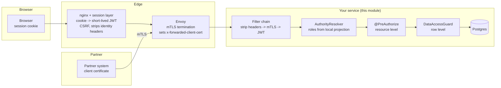

# security-spring-boot-starter

***English** · [Русский](README.ru.md)*

Authentication and authorization for Spring Boot microservices behind an nginx/Envoy edge, for a
deployment where:

- browser users hold an **opaque session cookie**, never a JWT — the edge exchanges the session for a
  short-lived token per request;
- external partners call the REST API directly over **mTLS**, terminated by Envoy;
- other services call in with their own **workload identity**;
- the OIDC provider issues **identity only** — no roles in the token — and streams the user directory
  over Kafka into each service's own database;
- access has to be restricted **by resource** (may this caller call this endpoint) *and* **by data**
  (which rows come back).

---

## The architecture question first: gateway or service?

**Both, and the split is not negotiable if you want it to hold.**

| Concern | Where | Why there |
|---|---|---|
| TLS/mTLS termination, client certificate chain validation | **Edge** | It is the only component holding the private keys and the partner trust bundle, and certificate validation is not something you want reimplemented per service. |
| Session cookie → JWT exchange, CSRF, session revocation | **Edge** | The session store lives there. A service that never sees a cookie cannot be CSRF'd. |
| Stripping client-supplied identity headers | **Edge**, and again in the service | One misconfigured route is otherwise a privilege escalation. Doing it twice costs a map lookup. |
| Coarse routing denials (`/internal/**` unreachable from the internet), rate limits, request size caps | **Edge** | Cheap to enforce, and it keeps obvious abuse off the service entirely. |
| Token validation (signature, issuer, **audience**, expiry) | **Service** | An audience check is per-service by definition, and a service must not assume it was only ever reached through the gateway. |
| Role / permission checks — *may this caller call this?* | **Service** | The roles are the service's own vocabulary. |
| Data scope — *which rows?* | **Service** | The gateway does not know what a row is. |

Three arguments for keeping authorization in the service, in order of how badly each one bites:

**1. A gateway cannot do data-level authorization at all.** "Show only the orders this user created" is a
predicate over a table the gateway has never heard of. If you put resource-level rules in the gateway and
data-level rules in the service, you have split one policy across two systems owned by two teams, and the
half that is easy to forget is the half that leaks rows.

**2. A gateway-only model fails open for everything that does not traverse the gateway.** Service-to-service
calls, Kafka consumers, scheduled jobs, an admin tool port-forwarded to a pod, a new ingress someone added
for a demo. Each is a path where the only enforcement point is absent. The gateway is a *filter*, not a
*boundary* — treat it as defence in depth, never as the decision point.

**3. A shared gateway policy becomes a config file nobody owns.** Every service's rules, in one place,
changed by every team, reviewed by none. Per-service policy lives next to the code it protects and is
reviewed by the people who know what the endpoint does.

What the gateway **is** essential for is authentication: it is where the session lives, where TLS is
terminated, and where a client certificate becomes a verified fact. This module's job starts one step
later — it takes those verified facts and decides what they are allowed to do.

### Request flows



Both doors end at the same `LudwigPrincipal`, and every rule downstream is written against that one type.

---

## The three callers

| | Browser user | Partner | Peer service |
|---|---|---|---|
| Credential at the edge | session cookie | client certificate | workload certificate |
| Credential at the service | JWT minted by the edge | `x-forwarded-client-cert` | JWT (client credentials) or XFCC |
| Identity | OIDC `sub` | partner code | SPIFFE workload id |
| `PrincipalType` | `USER` | `PARTNER` | `SERVICE` |
| Roles from | local projection of the OIDC stream | partner registry (table or config) | configuration |
| Typical data scope | `OWN`, `TENANT`, or `ALL` | `PARTNER` | `ALL` for its narrow purpose |

Keeping the type on the principal is what lets a policy say "partners never see this" without
re-deriving that fact from the transport at every check — and it is what stops a peer service from
picking up a data scope that was written for humans.

---

## Why roles are not in the token

The OIDC provider authenticates; this service authorizes. The JWT carries `sub`, a name and maybe a
tenant. Roles come from `AuthorityResolver`, which
[`identity-projection-spring-boot-starter`](../identity-projection-spring-boot-starter/README.md)
implements against the Kafka-fed user table.

- **Revocation is bounded by the cache TTL (seconds), not by the token lifetime.** A JWT that carries its
  roles keeps them until it expires, however fast the directory reacts. This is the argument that matters.
- **Tokens stay small and stable.** A user in forty groups does not carry forty claims through every hop,
  and granting a role does not require re-issuing tokens.
- **Each service owns its own vocabulary.** No global, ever-growing role list that every team appends to
  and nobody prunes.
- **A token that arrives carrying a `roles` claim is harmless** — nothing reads it. Nobody widens their
  access by influencing token issuance.

The cost is a lookup per request, which is why `AuthorityLookup` caches (Caffeine, TTL in seconds) and
why the projection evicts the cache the moment a Kafka event changes a user.

---

## Quick start

```xml
<dependency>
    <groupId>ru.ludwigandreas</groupId>
    <artifactId>security-spring-boot-starter</artifactId>
    <version>1.0.0</version>
</dependency>
<!-- roles and grants from the OIDC stream; without it nobody has any role -->
<dependency>
    <groupId>ru.ludwigandreas</groupId>
    <artifactId>identity-projection-spring-boot-starter</artifactId>
    <version>1.0.0</version>
</dependency>
<!-- backs the authority cache; optional, but every request re-resolves roles without it -->
<dependency>
    <groupId>com.github.ben-manes.caffeine</groupId>
    <artifactId>caffeine</artifactId>
</dependency>
```

Resource level — an annotation on the endpoint:

```java
@GetMapping("/{id}")
@PreAuthorize("hasAnyRole('ORDER_AGENT', 'ORDER_ADMIN')")
public OrderResponse get(@PathVariable UUID id) { ... }
```

Data level — declare once which columns carry which scope dimension:

```java
@Bean
DataScopeMapping<OrderEntity> orderScopeMapping() {
    QOrderEntity order = QOrderEntity.orderEntity;
    return DataScopeMapping.forResource("order", OrderEntity.class)
            .owner(order.createdBy, OrderEntity::getCreatedBy)
            .tenant(order.tenantId, OrderEntity::getTenantId, UUID::fromString)
            .partner(order.partnerId, OrderEntity::getPartnerId)
            .build();
}
```

…then write the policy in configuration:

```yaml
ludwig:
  security:
    data:
      default-access: NONE            # anything not listed is denied
      policies:
        order:
          read:
            ROLE_ORDER_ADMIN: ALL
            ROLE_ORDER_AGENT: OWN     # only rows they created
            ROLE_TENANT_VIEWER: TENANT
            ROLE_PARTNER: PARTNER
          write:
            ROLE_ORDER_ADMIN: ALL
            ROLE_ORDER_AGENT: OWN
```

…and use it in the two places rows are reached:

```java
// 1. Query time - the scope is part of the WHERE clause.
queryFactory.selectFrom(order)
        .where(guard.predicate("order", DataAction.READ).and(criteria))
        .fetch();

// 2. Load time - the safety net for every path a query predicate never sees.
OrderEntity entity = repository.getByIdOrThrow(id);
guard.check("order", DataAction.READ, entity, OrderEntity::getId);
```

Or, as an annotation, backed by the same mapping:

```java
@PostAuthorize("hasPermission(returnObject, 'read')")
public OrderEntity get(UUID id) { ... }
```

### Three shapes of rule

Which binding you reach for depends on the shape of the rule, not on taste. Each declares a query-time
half and a load-time half together, so the two cannot drift apart.

| Rule | Binding | Example |
|---|---|---|
| One column holds one value | `.owner(...)` / `.tenant(...)` / `.partner(...)` / `.bind(...)` | "orders this user created" |
| The row relates to many values, any of which may match | `.bindCollection(...)` | "orders this user is **mentioned** on" |
| Anything else | `.bindExpression(...)` | "mentioned, or the creator, and not revoked" |

```java
// "A LOADER sees every order they are mentioned on."
QOrderEntity order = QOrderEntity.orderEntity;

DataScopeMapping.forResource("order", OrderEntity.class)
        .owner(order.createdBy, OrderEntity::getCreatedBy)
        .bindCollection(ScopeDimension.of("mentioned"),
                order.mentions.any().userId,                                   // query side
                e -> e.getMentions().stream().map(Mention::getUserId).toList()) // load side
        .build();
```

`any()` is QueryDSL's to-many traversal and JPA renders it as a correlated `EXISTS`, not a join — which
matters, because a join multiplies one order by its four mentions and inflates both the page and its
total. On the load side the check is an intersection: the row matches when **any** value it relates to is
allowed.

The value itself comes from a `DataScopeProvider`, and that is where custom logic lives:

```java
@Bean
DataScopeProvider loaderMentionScopeProvider() {
    return (principal, resourceType, action) ->
            "order".equals(resourceType)
                    && DataAction.READ.equals(action)
                    && principal.hasRole("ROLE_LOADER")
                    ? DataScope.restrictedTo(ScopeDimension.of("mentioned"), principal.subject())
                    : DataScope.none();   // contributes nothing; other providers still apply
}
```

Providers are unioned, so this widens what the configured policy allows without touching it. The value
side is entirely yours — a database lookup, a time window, a call to another service.

`.bindExpression(...)` is the escape hatch for rules no single path reaches (a condition spanning two
attributes of the same child row, an `EXISTS` over an unmapped entity). It is the one shape where nothing
verifies that your predicate and your check agree with each other, so test them against each other —
`ExpressionScopeBindingTest` in this module shows the shape of such a test. Prefer the other two whenever
either can express the rule.

### Why both, and not one

**Pre-filtering alone misses** direct loads by id, entities reached through a relation, and objects
rebuilt from an event. **Post-checking alone breaks lists**: a page of 20 filtered after the fetch returns
fewer than 20 rows and a wrong total, the database still reads and ships rows the caller may not see, and
every aggregate computed before the filter is simply wrong.

So the mapping declares a **column** (for the predicate) and an **accessor** (for the check) for each
dimension, together, in one place — they cannot drift apart, and renaming either field breaks the build.

### How a scope is composed

A caller usually holds several roles, each granting a slice:

- values within one dimension are OR-ed (`IN`),
- dimensions within one grant are AND-ed (`OWN+TENANT` = "my rows, in my tenant"),
- grants are OR-ed (an agent who is also an auditor sees the union),
- `ALL` beats everything, `NONE` contributes nothing.

Providers compose the same way: `CompositeDataScopeProvider` unions the configuration-driven role policy
with any lookup-driven provider (for example the grant table in the identity module). A provider can
therefore only ever **widen** access. Denial is expressed by no provider granting — which is also what
makes the empty configuration safe.

---

## Fail-closed by construction

Every default here is the paranoid one, because the failure mode of the other choice is invisible:

| Situation | What happens | Why not the other way |
|---|---|---|
| Resource has no policy | Denied (`default-access: NONE`) | A new endpoint would otherwise ship unprotected. |
| Policy names a resource with no `DataScopeMapping` | **Startup failure** | An unmapped resource would be treated as unrestricted — every row published. |
| Policy names a dimension the mapping does not bind | **Startup failure** | An unenforceable clause must not be silently ignored. |
| Policy grant is misspelled (`OWNN`, `ALL+TENANT`) | **Startup failure** | Otherwise it surfaces on the first request that happens to exercise that role — in production, on one endpoint, as a 500. |
| Resource listed as both unscoped and policed | **Startup failure** | One of the two silently wins; which one is not obvious from either. |
| `mtls.enabled` with `forward-headers-strategy=native` | **Startup failure** (overridable) | The peer address becomes client-controlled, defeating `trusted-proxies` — see below. |
| Principal has no value for a required dimension (missing tenant claim) | Denied | Dropping the clause would turn "my tenant" into "all tenants". |
| Grant value cannot be parsed into the column type | Denied | "Rows whose id is `not-a-uuid`" is an empty set, not an absent filter. |
| Role store is unreachable | Request fails (500) | Substituting "no roles" turns a database blip into a fleet-wide outage — and, on any rule phrased as a denial, into a silent grant. |
| `x-forwarded-client-cert` from an untrusted peer | Request rejected, metric incremented | Silently ignoring it hides a spoofing attempt. |
| No `AuthorityResolver` registered | Startup failure when `authorities.require-resolver=true` | Otherwise the service runs with nobody holding any role, which looks like a permissions bug. |
| No audience configured | Startup failure when `jwt.require-audience=true` | A token minted for any other service that trusts the same issuer would be accepted. |

A list endpoint whose caller is entitled to nothing returns an **empty page**, not a 403 — a 403 on a
search confirms that matching rows exist.

---

## The mTLS / Envoy contract

Envoy terminates client TLS, validates the chain against the partner trust bundle, and describes the
result in `x-forwarded-client-cert`. The service does **not** re-verify the certificate: it either trusts
the peer that produced the header or it must not read the header at all.

That makes **one setting load-bearing**:

```yaml
ludwig:
  security:
    mtls:
      enabled: true
      trusted-proxies: 10.4.0.0/16     # the sidecar/ingress subnet, nothing wider
      service-identity-prefix: spiffe://mesh/ns/
```

`x-forwarded-client-cert` is an ordinary HTTP header. Anything that can open a TCP connection to the
service can send one claiming to be any partner. What makes it trustworthy is the certainty that only the
proxy can reach this port, and `trusted-proxies` is where that certainty is asserted. `0.0.0.0/0` there is
equivalent to having no partner authentication at all — the module refuses to start with it. The header
arriving from anywhere else is **rejected**, not ignored, because it is a security event and should look
like one.

#### The trap next to it: `forward-headers-strategy`

`trusted-proxies` compares against the request's peer address, and Spring Boot has two settings that
rewrite that address from a header the client controls:

- **`framework`** installs `ForwardedHeaderFilter`, which wraps the request so `getRemoteAddr()` answers
  from `X-Forwarded-For`. The module unwraps past every request wrapper to the address the container
  actually saw, so this is safe — and the unwrapping is the reason it is safe, not an accident.
- **`native`** installs Tomcat's `RemoteIpValve`, which rewrites the address on the request object
  itself, before any filter runs, and by default trusts `X-Forwarded-For` from **any private-range
  peer**. Inside a cluster that means any workload can claim the sidecar's address, satisfy
  `trusted-proxies`, and have a forged `x-forwarded-client-cert` believed — partner impersonation from an
  unauthenticated request. The module refuses to start in that combination.

If you need `native`, narrow `server.tomcat.remoteip.internal-proxies` to the proxies you actually trust
and set `ludwig.security.mtls.trust-native-forward-headers=true` to acknowledge it.

One more ordering detail, for the same reason: when mTLS is enabled the header-stripping filter
deliberately leaves `x-forwarded-client-cert` alone, so the mTLS filter can see a forged one and
**reject** it. Stripping it first would turn a spoofing attempt into an ordinary 401 with no warning and
no metric.

On the Envoy side, two settings matter:

```yaml
forward_client_cert_details: SANITIZE_SET   # replace any inbound XFCC; never append to a client's
set_current_client_cert_details:
  uri: true        # SPIFFE id - the identifier that survives renewal
  dns: true
  subject: true
  cert: false      # the PEM would put kilobytes of certificate in every log line
```

`SANITIZE_SET` is the important one: `APPEND_FORWARD` would let a client prepend its own element to the
chain.

Partners are matched most-stable identifier first — SPIFFE URI, then DNS SAN, then exact subject DN — and
optionally pinned to a certificate fingerprint. **Map to something that survives renewal.** A partner id
derived from a serial number or an expiry-bearing DN silently revokes that partner's access the day their
certificate is renewed.

Reference edge configuration is in [`docs/envoy-partner-gateway.yaml`](docs/envoy-partner-gateway.yaml)
and [`docs/nginx-edge.conf`](docs/nginx-edge.conf).

---

## Why the filter chain is stateless and CSRF is off

The browser's session cookie never reaches this service — the edge holds the session and exchanges it for
a token per request. A service that receives no ambient credential cannot be the target of a cross-site
request forgery: an attacker's page can make the browser issue a request, but it cannot make the edge
attach a token to it.

CSRF protection therefore belongs at the edge, on the cookie-to-token exchange, and duplicating it here
would only break API clients. **This reasoning holds only as long as the cookie really does stop at the
edge.** If you ever let the service accept the session cookie directly, turn CSRF protection back on in
the same change.

---

## What you get out of the box

| Concern | Type | Notes |
|---|---|---|
| One principal for all three caller types | `LudwigPrincipal`, `SecurityPrincipals` | `subject`, `type`, `tenantId`, roles, permissions, grant attributes |
| JWT → principal | `JwtPrincipalConverter` | identity from the token, entitlement from the resolver |
| Audience enforcement | `AudienceValidator` (+ decoder post-processor) | keeps Boot's decoder, appends the check |
| Partner/service mTLS | `MutualTlsAuthenticationFilter`, `XfccParser`, `TrustedProxies` | XFCC parsing that survives a comma in a subject DN; direct-termination fallback |
| Role resolution and cache | `AuthorityResolver`, `AuthorityLookup`, `AuthorityCache` | pluggable; Caffeine when present, no-op otherwise |
| Resource-level rules | `@PreAuthorize` / `@PostAuthorize` | method security is enabled by the module |
| Data-level rules | `DataAccessGuard`, `DataScopeMapping`, `DataScopePredicateFactory`, `DataScopePermissionEvaluator` | QueryDSL predicate + single-object check |
| Localized RFC 7807 401/403 | `ProblemDetailAuthenticationEntryPoint`, `ProblemDetailAccessDeniedHandler`, `SecurityMessages` | your bundle first, the module's shipped one as fallback |
| Header hygiene | `IdentityHeaderStrippingFilter` | strips XFCC and `x-forwarded-user`-style headers from untrusted peers |
| Audit trail | `AccessAuditLogger`, `AccessDecision`, `AuthorizationDeniedAuditListener` | denials at WARN on a dedicated logger — role-level *and* row-level; no payloads, no tokens |
| Startup validation | `DataScopePolicyValidator`, `ScopePolicies` | policies parsed and checked against the mappings before the first request |
| Metrics | `SecurityMetrics` | bounded tag vocabulary only — nothing caller-controlled |
| Background work | `SystemPrincipalTemplate` | explicit identity for schedulers and Kafka listeners |

### Deliberately not here

- **No session handling, login pages or token issuance.** That is the edge's job, and this module assumes
  it is done.
- **No Hibernate `@Filter` or Postgres row-level security.** Both are stronger containment, but they
  bypass compile-time checking and are hard to reason about across a three-model-layer service. A QueryDSL
  predicate over generated Q-types breaks the build when a column is renamed; a filter string does not.
  If you need containment against a compromised service rather than against a bug, add RLS *underneath*
  this — the two are not alternatives.
- **No distributed authority cache.** Authorities are cheap to recompute, and a shared cache turns an
  authorization decision into a call to a store an attacker could poison. Eviction rides the Kafka topic
  every instance already consumes.

---

## Errors a client sees

Both are RFC 7807 problems, localized, and deliberately uninformative:

```json
{ "type": "urn:ludwig:security:ludwig.security.error.forbidden",
  "title": "Forbidden",
  "detail": "You are not allowed to perform this operation.",
  "code": "ludwig.security.error.forbidden" }
```

Which role was missing, which scope excluded the row, which partner the certificate mapped to — all of it
is in the audit log keyed by subject, where support can find it and a caller cannot use it to map out the
permission model. Override any message by defining the same key in your own bundle; `SecurityMessages`
looks there first.

`@PreAuthorize` and the data guard throw *inside* MVC dispatch, after the security filter chain has handed
the request over, so the module's `AccessDeniedHandler` never sees them. If your service has its own
`@RestControllerAdvice`, add handlers for `AccessDeniedException` and `AuthenticationException` there —
see `ApiExceptionHandler` in the [example service](../crud-service-example/README.md).

---

## Configuration reference

```yaml
spring:
  security:
    oauth2:
      resourceserver:
        jwt:
          # issuer-uri performs OIDC discovery when the bean is created: the service will not start
          # while the provider is unreachable. Use jwk-set-uri (fetched lazily) if that matters.
          issuer-uri: https://login.example.internal/realms/corp

ludwig:
  security:
    enabled: true
    problem-type-prefix: "urn:ludwig:security:"
    public-paths: [/actuator/health, /actuator/health/**, /actuator/info]
    strip-identity-headers: true

    jwt:
      enabled: true
      subject-claim: sub
      name-claim: name
      tenant-claim: tenant_id
      service-client-claim: client_id   # presence marks the token as a peer service's
      audiences: [my-service]
      require-audience: true

    mtls:
      enabled: false
      trusted-proxies: []               # required when enabled; 0.0.0.0/0 is refused
      trust-native-forward-headers: false  # acknowledge a narrowed RemoteIpValve; see above
      service-identity-prefix: spiffe://mesh/ns/
      partners:                         # or use the identity module's security_partner table
        acme:
          display-name: ACME GmbH
          spiffe-id: spiffe://partners/acme
          certificate-hash: 468ed3...   # optional pin; must be updated at every renewal

    authorities:
      require-resolver: false           # set true in every deployed environment
      cache:
        enabled: true
        ttl: 60s                        # the window in which a revoked role still works
        maximum-size: 10000

    data:
      enabled: true
      default-access: NONE
      strict-policy-tokens: true
      unscoped-resources: []            # reference data, deliberately exempt
      policies: {}

    audit:
      enabled: true
      log-grants: false
    metrics:
      enabled: true
    system-principal:
      subject: system
      roles: []
```

### Metrics

`ludwig.security.authentication{principal.type,outcome,reason}`,
`ludwig.security.access.denied{resource,action}`,
`ludwig.security.authorities.cache{principal.type,result}`,
`ludwig.security.data.scope{resource,access}`.

Two worth alerting on: `authentication` with `reason=untrusted-proxy` means something is talking to the
service directly instead of through the mesh; `data.scope` reporting `access=ALL` for a resource you
believe is restricted means a policy is not matching.

---

## Rolling this into an existing fleet

1. **Add the module with `data.default-access: ALL`.** Nothing is denied yet. Watch
   `ludwig.security.data.scope` — every resource reporting `ALL` is one you have not written a policy for.
2. **Write `DataScopeMapping` beans and policies** resource by resource, starting with the ones holding
   data you would not want in the wrong response.
3. **Flip `default-access` to `NONE`** once the metric shows no unexplained `ALL`. This is the change that
   can break things; do it per service, not fleet-wide.
4. **Turn on `authorities.require-resolver` and `jwt.require-audience`** in every deployed environment, so
   a service can no longer start in a state where nothing is enforced.
5. **Enable mTLS on the partner routes last**, after `trusted-proxies` is correct in each environment.

---

## Module layout

| Package | Contents |
|---|---|
| `principal` | `LudwigPrincipal`, `PrincipalType`, `LudwigAuthentication`, `SecurityPrincipals`, `SystemPrincipalTemplate` |
| `authn.jwt` | JWT → principal conversion, audience validation |
| `authn.mtls` | XFCC parsing, partner resolution, trusted-proxy check, the filter |
| `authz` | `AuthorityResolver` SPI, `AuthorityLookup`, caching, `Authorities` |
| `data` | `DataScope`, mappings, providers, predicate factory, guard, permission evaluator |
| `web` | header stripping, problem-detail handlers, MDC, i18n |
| `audit`, `metrics` | decision trail and instrumentation |
| `config` | properties and autoconfiguration |
