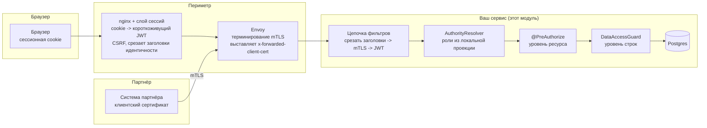

# security-spring-boot-starter

*[English](README.md) · **Русский***

Аутентификация и авторизация для микросервисов на Spring Boot, стоящих за периметром из nginx/Envoy —
для контура, в котором:

- пользователи в браузере держат **непрозрачную сессионную cookie**, а не JWT: периметр обменивает сессию
  на короткоживущий токен на каждый запрос;
- внешние партнёры обращаются к REST API напрямую по **mTLS**, который терминирует Envoy;
- другие сервисы приходят со своей **workload-идентичностью**;
- OIDC-провайдер выдаёт **только идентичность** — ролей в токене нет — и транслирует каталог
  пользователей через Kafka в собственную базу каждого сервиса;
- доступ нужно ограничивать **по ресурсам** (может ли этот вызывающий обратиться к этому эндпоинту)
  *и* **по данным** (какие строки вернутся).

---

## Сначала архитектурный вопрос: шлюз или сервис?

**И то и другое, и это разделение нельзя размывать, если вы хотите, чтобы оно держалось.**

| Задача | Где | Почему именно там |
|---|---|---|
| Терминирование TLS/mTLS, проверка цепочки клиентского сертификата | **Периметр** | Это единственный компонент, у которого есть приватные ключи и набор доверенных корневых сертификатов партнёров; проверку сертификата не стоит переписывать в каждом сервисе. |
| Обмен сессионной cookie на JWT, CSRF, отзыв сессии | **Периметр** | Хранилище сессий живёт там. Сервис, который никогда не видит cookie, невозможно атаковать через CSRF. |
| Отбрасывание заголовков идентичности, присланных клиентом | **Периметр**, и ещё раз в сервисе | Один неправильно настроенный маршрут — и это повышение привилегий. Повторная проверка стоит одного поиска по множеству. |
| Грубые запреты маршрутизации (`/internal/**` недоступен из интернета), rate limit, ограничение размера запроса | **Периметр** | Дёшево применить, и очевидные злоупотребления вообще не доходят до сервиса. |
| Валидация токена (подпись, issuer, **audience**, срок действия) | **Сервис** | Проверка audience по определению относится к конкретному сервису, а сервис не должен исходить из того, что до него всегда добирались только через шлюз. |
| Проверка ролей и прав — *может ли этот вызывающий это сделать?* | **Сервис** | Роли — это собственный словарь сервиса. |
| Область доступа к данным — *какие строки?* | **Сервис** | Шлюз не знает, что такое строка. |

Три довода за то, чтобы авторизация жила в сервисе, в порядке серьёзности последствий:

**1. Шлюз в принципе не умеет авторизацию на уровне данных.** «Показывать только заказы, созданные этим
пользователем» — это предикат по таблице, о которой шлюз никогда не слышал. Если правила уровня ресурса
положить в шлюз, а правила уровня данных — в сервис, одна политика окажется размазана между двумя
системами с двумя владельцами, и та половина, про которую легко забыть, — как раз та, через которую
утекают строки.

**2. Модель «только шлюз» открывается настежь для всего, что мимо шлюза не идёт.** Вызовы между
сервисами, консьюмеры Kafka, шедулеры, админская утилита через port-forward к поду, новый ingress,
который кто-то добавил ради демо. В каждом из этих путей единственная точка контроля просто
отсутствует. Шлюз — это *фильтр*, а не *граница*: относитесь к нему как к эшелонированной защите, но
никогда как к месту принятия решения.

**3. Общая политика на шлюзе превращается в конфиг без владельца.** Правила всех сервисов в одном месте,
меняют их все команды, ревьюит — никто. Политика конкретного сервиса лежит рядом с кодом, который она
защищает, и её ревьюят люди, понимающие, что делает эндпоинт.

Без чего периметр **действительно** необходим — так это без аутентификации: там живёт сессия, там
терминируется TLS, и там клиентский сертификат становится проверенным фактом. Работа этого модуля
начинается на шаг позже — он берёт эти проверенные факты и решает, что им разрешено.

### Потоки запросов



Обе двери заканчиваются одним и тем же `LudwigPrincipal`, и все правила ниже написаны против этого
единственного типа.

---

## Три вида вызывающих

| | Пользователь в браузере | Партнёр | Соседний сервис |
|---|---|---|---|
| Учётные данные на периметре | сессионная cookie | клиентский сертификат | workload-сертификат |
| Учётные данные в сервисе | JWT, выпущенный периметром | `x-forwarded-client-cert` | JWT (client credentials) или XFCC |
| Идентичность | OIDC `sub` | код партнёра | SPIFFE workload id |
| `PrincipalType` | `USER` | `PARTNER` | `SERVICE` |
| Роли берутся из | локальной проекции OIDC-потока | реестра партнёров (таблица или конфиг) | конфигурации |
| Типичная область данных | `OWN`, `TENANT` или `ALL` | `PARTNER` | `ALL` в рамках своей узкой задачи |

Именно тип на принципале позволяет политике сказать «партнёры этого не видят», не выводя этот факт
заново из транспорта при каждой проверке, — и именно он не даёт соседнему сервису подобрать область
данных, написанную для людей.

---

## Почему ролей нет в токене

OIDC-провайдер аутентифицирует; этот сервис авторизует. В JWT лежат `sub`, имя и, возможно, тенант. Роли
приходят из `AuthorityResolver`, который реализует
[`identity-projection-spring-boot-starter`](../identity-projection-spring-boot-starter/README.ru.md)
поверх таблицы пользователей, наполняемой из Kafka.

- **Отзыв прав ограничен TTL кэша (секунды), а не временем жизни токена.** JWT, который несёт роли внутри
  себя, сохраняет их до истечения срока — как бы быстро ни отреагировал каталог. Это и есть решающий
  довод.
- **Токены остаются маленькими и стабильными.** Пользователь в сорока группах не таскает сорок клеймов
  через каждый хоп, а выдача роли не требует перевыпуска токенов.
- **Каждый сервис владеет своим словарём.** Никакого глобального, бесконечно растущего списка ролей, в
  который все дописывают и который никто не чистит.
- **Токен, пришедший с клеймом `roles`, безвреден** — его никто не читает. Никто не расширит свои права,
  повлияв на выпуск токенов.

Цена — поиск на каждый запрос, поэтому `AuthorityLookup` кэширует (Caffeine, TTL в секундах), а проекция
инвалидирует кэш в тот момент, когда событие Kafka меняет пользователя.

---

## Быстрый старт

```xml
<dependency>
    <groupId>ru.ludwigandreas</groupId>
    <artifactId>security-spring-boot-starter</artifactId>
    <version>1.0.0</version>
</dependency>
<!-- роли и гранты из OIDC-потока; без него ни у кого нет ни одной роли -->
<dependency>
    <groupId>ru.ludwigandreas</groupId>
    <artifactId>identity-projection-spring-boot-starter</artifactId>
    <version>1.0.0</version>
</dependency>
<!-- бэкенд кэша прав; необязателен, но без него роли резолвятся на каждый запрос -->
<dependency>
    <groupId>com.github.ben-manes.caffeine</groupId>
    <artifactId>caffeine</artifactId>
</dependency>
```

Уровень ресурса — аннотация на эндпоинте:

```java
@GetMapping("/{id}")
@PreAuthorize("hasAnyRole('ORDER_AGENT', 'ORDER_ADMIN')")
public OrderResponse get(@PathVariable UUID id) { ... }
```

Уровень данных — один раз объявите, какие колонки несут какое измерение области доступа:

```java
@Bean
DataScopeMapping<OrderEntity> orderScopeMapping() {
    QOrderEntity order = QOrderEntity.orderEntity;
    return DataScopeMapping.forResource("order", OrderEntity.class)
            .owner(order.createdBy, OrderEntity::getCreatedBy)
            .tenant(order.tenantId, OrderEntity::getTenantId, UUID::fromString)
            .partner(order.partnerId, OrderEntity::getPartnerId)
            .build();
}
```

…дальше пишите политику в конфигурации:

```yaml
ludwig:
  security:
    data:
      default-access: NONE            # всё, чего нет в списке, запрещено
      policies:
        order:
          read:
            ROLE_ORDER_ADMIN: ALL
            ROLE_ORDER_AGENT: OWN     # только созданные ими строки
            ROLE_TENANT_VIEWER: TENANT
            ROLE_PARTNER: PARTNER
          write:
            ROLE_ORDER_ADMIN: ALL
            ROLE_ORDER_AGENT: OWN
```

…и применяйте её в двух местах, где до строк вообще доходит дело:

```java
// 1. Во время запроса - область доступа становится частью WHERE.
queryFactory.selectFrom(order)
        .where(guard.predicate("order", DataAction.READ).and(criteria))
        .fetch();

// 2. Во время загрузки - страховка для всех путей, которых предикат запроса не видит.
OrderEntity entity = repository.getByIdOrThrow(id);
guard.check("order", DataAction.READ, entity, OrderEntity::getId);
```

Либо аннотацией, поверх того же маппинга:

```java
@PostAuthorize("hasPermission(returnObject, 'read')")
public OrderEntity get(UUID id) { ... }
```

### Три формы правила

Какое связывание выбрать, определяется формой правила, а не вкусом. Каждое объявляет половину для
запроса и половину для загрузки вместе, так что разъехаться они не могут.

| Правило | Связывание | Пример |
|---|---|---|
| Одна колонка хранит одно значение | `.owner(...)` / `.tenant(...)` / `.partner(...)` / `.bind(...)` | «заказы, созданные этим пользователем» |
| Строка связана со многими значениями, подходит любое из них | `.bindCollection(...)` | «заказы, в которых он **упомянут**» |
| Всё остальное | `.bindExpression(...)` | «упомянут или создатель, и упоминание не отозвано» |

```java
// «LOADER видит все заказы, в которых он упомянут.»
QOrderEntity order = QOrderEntity.orderEntity;

DataScopeMapping.forResource("order", OrderEntity.class)
        .owner(order.createdBy, OrderEntity::getCreatedBy)
        .bindCollection(ScopeDimension.of("mentioned"),
                order.mentions.any().userId,                                   // сторона запроса
                e -> e.getMentions().stream().map(Mention::getUserId).toList()) // сторона загрузки
        .build();
```

`any()` — это обход связи «ко многим» в QueryDSL, и JPA превращает его в коррелированный `EXISTS`, а не в
join. Это важно: join размножил бы один заказ на четыре его упоминания и завысил бы и страницу, и её
итог. На стороне загрузки проверка — пересечение: строка подходит, если разрешено **любое** из связанных
с ней значений.

Само значение приходит из `DataScopeProvider`, и именно там живёт кастомная логика:

```java
@Bean
DataScopeProvider loaderMentionScopeProvider() {
    return (principal, resourceType, action) ->
            "order".equals(resourceType)
                    && DataAction.READ.equals(action)
                    && principal.hasRole("ROLE_LOADER")
                    ? DataScope.restrictedTo(ScopeDimension.of("mentioned"), principal.subject())
                    : DataScope.none();   // ничего не добавляет; остальные провайдеры продолжают работать
}
```

Провайдеры объединяются, поэтому это расширяет то, что разрешает настроенная политика, не трогая её.
Сторона значений полностью ваша — запрос в базу, временное окно, вызов другого сервиса.

`.bindExpression(...)` — запасной выход для правил, до которых не дотягивается ни один путь (условие по
двум атрибутам одной и той же дочерней строки, `EXISTS` по несвязанной сущности). Это единственная форма,
где ничто не проверяет, что ваш предикат и ваша проверка согласуются между собой, поэтому тестируйте их
друг против друга — `ExpressionScopeBindingTest` в этом модуле показывает форму такого теста. Предпочитайте
две другие формы везде, где любая из них выражает правило.

### Почему оба, а не один

**Одной только фильтрации в запросе не хватает**: она не видит прямых загрузок по id, сущностей,
полученных по связи, и объектов, восстановленных из события. **Одной только пост-проверки не хватает для
списков**: страница из 20 записей, отфильтрованная после выборки, вернёт меньше 20 строк и неверный
итог, база всё равно прочитает и передаст строки, которых вызывающий видеть не должен, а любая агрегация,
посчитанная до фильтра, будет просто неправильной.

Поэтому маппинг объявляет **колонку** (для предиката) и **аксессор** (для проверки) на каждое измерение
вместе, в одном месте: разъехаться они не могут, а переименование любого из полей ломает сборку.

### Как складывается область доступа

У вызывающего обычно несколько ролей, каждая даёт свой кусок:

- значения внутри одного измерения объединяются по ИЛИ (`IN`),
- измерения внутри одного гранта объединяются по И (`OWN+TENANT` = «мои строки в моём тенанте»),
- гранты объединяются по ИЛИ (агент, который ещё и аудитор, видит объединение),
- `ALL` перебивает всё, `NONE` не добавляет ничего.

Провайдеры складываются так же: `CompositeDataScopeProvider` объединяет ролевую политику из конфигурации
с любым провайдером, который смотрит в хранилище (например, с таблицей грантов в модуле identity).
Значит, провайдер может только **расширить** доступ. Запрет выражается тем, что ни один провайдер ничего
не выдал, — и именно поэтому пустая конфигурация безопасна.

---

## Запрет по умолчанию, по построению

Каждое значение по умолчанию здесь — параноидальное, потому что последствия другого выбора невидимы:

| Ситуация | Что происходит | Почему не наоборот |
|---|---|---|
| Для ресурса нет политики | Запрет (`default-access: NONE`) | Иначе новый эндпоинт уехал бы в прод незащищённым. |
| Политика называет ресурс, для которого нет `DataScopeMapping` | **Падение на старте** | Незамапленный ресурс считался бы неограниченным — и все строки уехали бы наружу. |
| Политика называет измерение, которое маппинг не связывает | **Падение на старте** | Невыполнимое условие нельзя молча игнорировать. |
| Грант в политике написан с опечаткой (`OWNN`, `ALL+TENANT`) | **Падение на старте** | Иначе это всплывает на первом же запросе, который задействует эту роль, — в проде, на одном эндпоинте, как 500. |
| Ресурс указан и как unscoped, и в политиках | **Падение на старте** | Одна из настроек молча побеждает, и по любой из них не видно, какая именно. |
| `mtls.enabled` вместе с `forward-headers-strategy=native` | **Падение на старте** (переопределяемо) | Адрес узла становится управляемым клиентом, и `trusted-proxies` обесценивается — см. ниже. |
| У принципала нет значения для нужного измерения (нет клейма тенанта) | Запрет | Выбросить условие — значит превратить «мой тенант» в «все тенанты». |
| Значение гранта не приводится к типу колонки | Запрет | «Строки, у которых id равен `not-a-uuid`» — это пустое множество, а не отсутствие фильтра. |
| Хранилище ролей недоступно | Запрос падает (500) | Подстановка «ролей нет» превращает сбой базы в отказ всего флота — а на любом правиле, сформулированном как запрет, в молчаливое разрешение. |
| `x-forwarded-client-cert` от недоверенного узла | Запрос отклонён, метрика увеличена | Молча проигнорировать — значит спрятать попытку подмены. |
| Не зарегистрирован `AuthorityResolver` | Падение на старте при `authorities.require-resolver=true` | Иначе сервис работает в состоянии, где ни у кого нет ролей, и это выглядит как баг прав доступа. |
| Не настроен audience | Падение на старте при `jwt.require-audience=true` | Иначе принимается токен, выпущенный тем же issuer для любого другого сервиса. |

Списочный эндпоинт, вызывающий которого не имеет прав ни на что, возвращает **пустую страницу**, а не
403: 403 на поиске подтверждает, что подходящие строки существуют.

---

## Контракт mTLS / Envoy

Envoy терминирует клиентский TLS, проверяет цепочку по набору доверенных корневых сертификатов партнёров
и описывает результат в `x-forwarded-client-cert`. Сервис **не** перепроверяет сертификат: он либо
доверяет узлу, сформировавшему заголовок, либо не должен читать этот заголовок вовсе.

Из-за этого **одна настройка становится несущей**:

```yaml
ludwig:
  security:
    mtls:
      enabled: true
      trusted-proxies: 10.4.0.0/16     # подсеть сайдкара/ingress, и ничего шире
      service-identity-prefix: spiffe://mesh/ns/
```

`x-forwarded-client-cert` — обычный HTTP-заголовок. Всё, что может открыть TCP-соединение к сервису,
может прислать его, назвавшись любым партнёром. Доверять ему позволяет только уверенность, что до этого
порта дотягивается лишь прокси, и `trusted-proxies` — то место, где эта уверенность утверждается.
`0.0.0.0/0` здесь равносилен полному отсутствию аутентификации партнёров — модуль отказывается стартовать
с таким значением. Заголовок, пришедший откуда-то ещё, **отклоняется**, а не игнорируется: это событие
безопасности, и выглядеть оно должно именно так.

#### Ловушка рядом: `forward-headers-strategy`

`trusted-proxies` сравнивает адрес узла, с которого пришёл запрос, а в Spring Boot есть две настройки,
которые переписывают этот адрес из заголовка, управляемого клиентом:

- **`framework`** ставит `ForwardedHeaderFilter`, который оборачивает запрос так, что `getRemoteAddr()`
  отвечает из `X-Forwarded-For`. Модуль разворачивает все обёртки запроса до адреса, который реально
  увидел контейнер, — и именно это разворачивание делает вариант безопасным, а не случайность.
- **`native`** ставит Tomcat-овский `RemoteIpValve`, который переписывает адрес на самом объекте запроса
  ещё до всех фильтров и по умолчанию доверяет `X-Forwarded-For` от **любого узла из приватных
  диапазонов**. Внутри кластера это означает, что любая нагрузка может назваться адресом сайдкара,
  пройти `trusted-proxies` и добиться доверия к поддельному `x-forwarded-client-cert` — выдача себя за
  партнёра из неаутентифицированного запроса. Модуль отказывается стартовать в этой комбинации.

Если `native` действительно нужен, сузьте `server.tomcat.remoteip.internal-proxies` до реально доверенных
прокси и подтвердите это через `ludwig.security.mtls.trust-native-forward-headers=true`.

Ещё одна деталь порядка, по той же причине: когда mTLS включён, фильтр срезания заголовков намеренно
оставляет `x-forwarded-client-cert` на месте, чтобы mTLS-фильтр увидел подделку и **отклонил** запрос.
Если срезать заголовок раньше, попытка подмены превратится в обычный 401 — без предупреждения и без
метрики.

Со стороны Envoy важны две настройки:

```yaml
forward_client_cert_details: SANITIZE_SET   # заменять входящий XFCC, а не дописывать к клиентскому
set_current_client_cert_details:
  uri: true        # SPIFFE id - идентификатор, переживающий перевыпуск
  dns: true
  subject: true
  cert: false      # PEM положил бы килобайты сертификата в каждую строку лога
```

Ключевая — первая: `APPEND_FORWARD` позволил бы клиенту подставить собственный элемент в начало цепочки.

Партнёры сопоставляются от самого стабильного идентификатора к менее стабильному — SPIFFE URI, затем DNS
SAN, затем точный subject DN — и по желанию привязываются к отпечатку сертификата. **Сопоставляйте по
тому, что переживает перевыпуск.** Идентификатор партнёра, выведенный из серийного номера или DN со
сроком, молча отзовёт доступ партнёра в день перевыпуска его сертификата.

Эталонные конфигурации периметра — в [`docs/envoy-partner-gateway.yaml`](docs/envoy-partner-gateway.yaml)
и [`docs/nginx-edge.conf`](docs/nginx-edge.conf).

---

## Почему цепочка фильтров stateless, а CSRF выключен

Сессионная cookie браузера до этого сервиса не доходит: сессию держит периметр и обменивает её на токен
на каждый запрос. Сервис, который не получает никаких «фоновых» учётных данных, не может стать целью
cross-site request forgery: страница атакующего заставит браузер отправить запрос, но не заставит
периметр приложить к нему токен.

Поэтому защита от CSRF — дело периметра, на обмене cookie на токен, а её дублирование здесь только
сломало бы API-клиентов. **Это рассуждение верно ровно до тех пор, пока cookie действительно
останавливается на периметре.** Если вы когда-нибудь разрешите сервису принимать сессионную cookie
напрямую — включите защиту от CSRF в том же изменении.

---

## Что вы получаете из коробки

| Задача | Тип | Примечания |
|---|---|---|
| Один принципал для всех трёх видов вызывающих | `LudwigPrincipal`, `SecurityPrincipals` | `subject`, `type`, `tenantId`, роли, права, атрибуты грантов |
| JWT → принципал | `JwtPrincipalConverter` | идентичность из токена, права из резолвера |
| Проверка audience | `AudienceValidator` (+ пост-процессор декодера) | сохраняет декодер Boot, добавляя проверку |
| mTLS партнёров и сервисов | `MutualTlsAuthenticationFilter`, `XfccParser`, `TrustedProxies` | разбор XFCC, переживающий запятую в subject DN; запасной путь для прямого терминирования |
| Резолвинг ролей и кэш | `AuthorityResolver`, `AuthorityLookup`, `AuthorityCache` | подключаемые; Caffeine, если есть, иначе no-op |
| Правила уровня ресурса | `@PreAuthorize` / `@PostAuthorize` | method security включается модулем |
| Правила уровня данных | `DataAccessGuard`, `DataScopeMapping`, `DataScopePredicateFactory`, `DataScopePermissionEvaluator` | предикат QueryDSL + проверка одного объекта |
| Локализованные RFC 7807 401/403 | `ProblemDetailAuthenticationEntryPoint`, `ProblemDetailAccessDeniedHandler`, `SecurityMessages` | сначала ваш бандл, потом поставляемый модулем |
| Гигиена заголовков | `IdentityHeaderStrippingFilter` | срезает XFCC и заголовки вида `x-forwarded-user` от недоверенных узлов |
| Аудит | `AccessAuditLogger`, `AccessDecision`, `AuthorizationDeniedAuditListener` | отказы на WARN в отдельный логгер — и на уровне ролей, и на уровне строк; ни тел запросов, ни токенов |
| Проверка на старте | `DataScopePolicyValidator`, `ScopePolicies` | политики разбираются и сверяются с маппингами до первого запроса |
| Метрики | `SecurityMetrics` | только ограниченный словарь тегов — ничего, чем управляет вызывающий |
| Фоновые задачи | `SystemPrincipalTemplate` | явная идентичность для шедулеров и Kafka-листенеров |

### Чего здесь намеренно нет

- **Нет работы с сессиями, страниц входа и выпуска токенов.** Это дело периметра, и модуль исходит из
  того, что оно уже сделано.
- **Нет Hibernate `@Filter` и row-level security в Postgres.** Оба дают более жёсткую изоляцию, но
  обходят проверки времени компиляции и плохо читаются в сервисе с тремя слоями моделей. Предикат
  QueryDSL по сгенерированным Q-типам ломает сборку при переименовании колонки; строковый фильтр — нет.
  Если вам нужна защита от скомпрометированного сервиса, а не от ошибки в коде, добавьте RLS *под* этим
  модулем — это не альтернативы друг другу.
- **Нет распределённого кэша прав.** Права дёшево пересчитать, а общий кэш превращает решение об
  авторизации в вызов к хранилищу, которое атакующий может отравить. Инвалидация едет по тому же
  Kafka-топику, который и так читает каждый инстанс.

---

## Что видит клиент при ошибке

Оба ответа — RFC 7807 problem, локализованные и намеренно неинформативные:

```json
{ "type": "urn:ludwig:security:ludwig.security.error.forbidden",
  "title": "Доступ запрещён",
  "detail": "У вас нет прав на выполнение этой операции.",
  "code": "ludwig.security.error.forbidden" }
```

Какой роли не хватило, какая область доступа отсекла строку, в какого партнёра отобразился сертификат —
всё это в журнале аудита с ключом по subject, где поддержка это найдёт, а вызывающий не сможет по этому
восстановить модель прав. Любое сообщение переопределяется тем же ключом в вашем бандле — `SecurityMessages`
смотрит туда первым.

`@PreAuthorize` и guard данных бросают исключения *внутри* MVC-диспетчеризации, уже после того как
цепочка фильтров безопасности передала запрос дальше, поэтому `AccessDeniedHandler` модуля их не видит.
Если у сервиса есть свой `@RestControllerAdvice`, добавьте туда обработчики `AccessDeniedException` и
`AuthenticationException` — см. `ApiExceptionHandler` в
[сервисе-примере](../crud-service-example/README.md).

---

## Справочник по конфигурации

```yaml
spring:
  security:
    oauth2:
      resourceserver:
        jwt:
          # issuer-uri выполняет OIDC discovery при создании бина: сервис не стартует, пока провайдер
          # недоступен. Если это важно, используйте jwk-set-uri (загружается лениво).
          issuer-uri: https://login.example.internal/realms/corp

ludwig:
  security:
    enabled: true
    problem-type-prefix: "urn:ludwig:security:"
    public-paths: [/actuator/health, /actuator/health/**, /actuator/info]
    strip-identity-headers: true

    jwt:
      enabled: true
      subject-claim: sub
      name-claim: name
      tenant-claim: tenant_id
      service-client-claim: client_id   # наличие помечает токен как принадлежащий соседнему сервису
      audiences: [my-service]
      require-audience: true

    mtls:
      enabled: false
      trusted-proxies: []               # обязателен при enabled; 0.0.0.0/0 отвергается
      trust-native-forward-headers: false  # подтверждение суженного RemoteIpValve; см. выше
      service-identity-prefix: spiffe://mesh/ns/
      partners:                         # либо таблица security_partner из модуля identity
        acme:
          display-name: ACME GmbH
          spiffe-id: spiffe://partners/acme
          certificate-hash: 468ed3...   # необязательная привязка; обновляется при каждом перевыпуске

    authorities:
      require-resolver: false           # включайте во всех развёрнутых окружениях
      cache:
        enabled: true
        ttl: 60s                        # окно, в котором отозванная роль ещё работает
        maximum-size: 10000

    data:
      enabled: true
      default-access: NONE
      strict-policy-tokens: true
      unscoped-resources: []            # справочные данные, намеренно вне области доступа
      policies: {}

    audit:
      enabled: true
      log-grants: false
    metrics:
      enabled: true
    system-principal:
      subject: system
      roles: []
```

### Метрики

`ludwig.security.authentication{principal.type,outcome,reason}`,
`ludwig.security.access.denied{resource,action}`,
`ludwig.security.authorities.cache{principal.type,result}`,
`ludwig.security.data.scope{resource,access}`.

Две стоит завести в алерты: `authentication` с `reason=untrusted-proxy` означает, что кто-то ходит в
сервис напрямую в обход меша; `data.scope` с `access=ALL` для ресурса, который вы считаете
ограниченным, означает, что политика не срабатывает.

---

## Как выкатывать это на существующий флот

1. **Подключите модуль с `data.default-access: ALL`.** Пока ничего не запрещается. Смотрите на
   `ludwig.security.data.scope` — каждый ресурс с `ALL` это ресурс, для которого вы ещё не написали
   политику.
2. **Опишите бины `DataScopeMapping` и политики** ресурс за ресурсом, начиная с тех, чьи данные вы не
   хотели бы увидеть в чужом ответе.
3. **Переключите `default-access` на `NONE`**, когда метрика перестанет показывать необъяснимые `ALL`.
   Это то изменение, которое может что-то сломать: делайте его по одному сервису, а не всем флотом сразу.
4. **Включите `authorities.require-resolver` и `jwt.require-audience`** во всех развёрнутых окружениях,
   чтобы сервис больше не мог стартовать в состоянии, где ничего не проверяется.
5. **mTLS на партнёрских маршрутах включайте последним**, когда `trusted-proxies` уже корректен в каждом
   окружении.

---

## Состав модуля

| Пакет | Содержимое |
|---|---|
| `principal` | `LudwigPrincipal`, `PrincipalType`, `LudwigAuthentication`, `SecurityPrincipals`, `SystemPrincipalTemplate` |
| `authn.jwt` | преобразование JWT → принципал, проверка audience |
| `authn.mtls` | разбор XFCC, определение партнёра, проверка доверенного прокси, фильтр |
| `authz` | SPI `AuthorityResolver`, `AuthorityLookup`, кэширование, `Authorities` |
| `data` | `DataScope`, маппинги, провайдеры, фабрика предикатов, guard, permission evaluator |
| `web` | срезание заголовков, обработчики problem detail, MDC, i18n |
| `audit`, `metrics` | журнал решений и инструментирование |
| `config` | properties и автоконфигурации |

## Аудит

У этого модуля больше нет собственного механизма аудита. `AccessAuditLogger` и `Slf4jAccessAuditLogger` удалены. Его журнал теперь идёт через
единственный в платформе `AuditSink`, который развёртывание направляет в лог, в таблицу `audit_event`
(только на добавление), в SIEM через транзакционный outbox или в несколько мест сразу - см.
[`audit-core`](../audit-core) and [`audit-spring-boot-starter`](../audit-spring-boot-starter).

`AccessDecision` остаётся и получил `toAuditEvent()` - и именно *из этой* записи выведен конверт
платформы, потому что она уже была самым близким к универсальному в репозитории: субъект, тип ресурса,
идентификатор ресурса, действие, исход, причина. Отказ записывается с исходом `DENIED`, а не
`FAILURE`, и это различие нужно реагирующему на инцидент первым: "мы им отказали" и "мы сломались"
выглядят одинаково в колонке `granted=false` и ведут к противоположным расследованиям. `scopeAccess`
становится атрибутом, потому что широта выданного доступа - факт о модели областей данных этой
платформы, а не об аудите вообще.

Этот модуль также публикует `PrincipalActorResolver` - именно он учит единственное в платформе разрешение
субъекта про `LudwigPrincipal` и его `PrincipalType`. `audit-core` не может знать об этом типе - он не
зависит ни от чего в репозитории, что и позволяет этому модулю зависеть от него - поэтому богатый резолвер
живёт здесь, а два более простых из `audit-core` уступают по *наличию* `LudwigPrincipal` на classpath.
Причина, по которой он вообще нужен, конкретна: `Authentication.getName()` на токене, чей principal -
`LudwigPrincipal`, отвечает `toString()` этого объекта, а не его субъектом, так что журнал несёт
отрендеренный объект там, где место соединяемому идентификатору.

Он живёт в собственной автоконфигурации `SecurityAuditAutoConfiguration` и не привязан **ни** к
`ludwig.security.audit.enabled`, **ни** к `ludwig.security.enabled`. Они управляют тем, записываются ли
*решения* доступа и ставит ли модуль цепочку фильтров; разрешение субъекта - другое, и оно питает двух
потребителей: каждый `AuditEvent.actor` и штамповку `created_by` / `last_modified_by` в `db-core`. Привязка
означала бы, что выключение security-стартера молча меняет, какое имя появляется в колонках аудита каждой
сущности и в каждом событии аудита, - с субъекта человека на `system`, и без единого сигнала. Неверное
значение в журнале, который хранится годами, - худший отказ, чем отсутствующий бин.

`ludwig.security.audit.log-grants` по-прежнему работает и теперь означает то, что говорит. Оно
переехало из приёмника в `DataAccessGuard`, потому что приёмник общий: как только выдача может попасть
в таблицу только на добавление и в SIEM, а не только в уровень лога, который можно приглушить, "не
записывать их" должно означать "не порождать их", а не "порождать тихо".

**Что заметит развёртывание:** логгера `ru.ludwigandreas.security.audit` больше нет; решения - в `ru.ludwigandreas.audit` с
`category=access`, отказы на WARN, выдачи на INFO.
